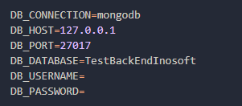

## Documentation Of API

-   [Documentation](https://documenter.getpostman.com/view/19154922/UVXjHavo).

## Installation

-   Clone Or Download The Project
-   Get Into Project Folder
-   Run "**composer install**"
-   Set your DB on ENV

</a>

-   Run "**php artisan key:generate**"
-   if you need some dummy data for testing Run "**php artisan migrate --seed**" it will provide 1000 data
-   after you complete all list above Run"**php artisan serve**"
